# Computer Graphics Assignment 2
3D Viewing Pipeline and Object Modeling

[Documentation](../docs/html/index.html)

Course Assignment for IS F311- Computer Graphics @ BITS Pilani, Hyderabad Campus.

**Done under the guidance of Prof. Tathagata Ray, Assistant Professor, BITS Pilani, Hyderabad Campus.**

## Instructions to run the scripts
Run the following command in terminal:
```
g++ reference.cpp objLoader.cpp primitives.cpp -lglfw -pthread -lGLEW -lGLU -lGL -lglut

./a.out
```

## Task 1: Using OpenGL Primitives

A 3D object is defined using vertices. In order to apply any transformation to the object, the transformation (rotation, scaling translation) must be applied to the individual vertices of the object.
To do this, the vector of the vertex must be pre-multiplied by a transformation matrix.
Following are some examples of transformation matrices-

**Rotation matrix**

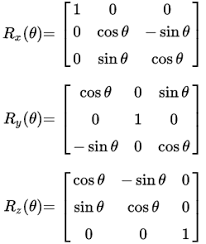

**Translation matrix**

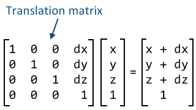

**Scaling matrix**

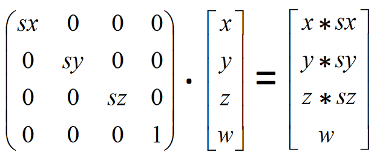

The following image is a block diagram depicting the OpenGL vertex transformation process.


#### Object coordinates
It is the local coordinate system of objects and is initial position and orientation of objects before any transform is applied.

####Eye coordinates
It is yielded by multiplying GL_MODELVIEW matrix and object coordinates. Objects are transformed from object space to eye space using GL_MODELVIEW matrix in OpenGL. GL_MODELVIEW matrix is a combination of Model and View matrices (Mview * Mmodel). Model transform is to convert from object space to world space. And, View transform is to convert from world space to eye space.
Normal vectors are also transformed from object coordinates to eye coordinates for lighting calculation. It is done by mutiplying the tranpose of the inverse of GL_MODELVIEW matrix by a normal vector.

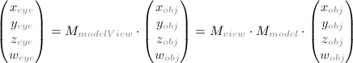

#### Clip coordinates
The eye coordinates are now multiplied with GL_PROJECTION matrix, and become the clip coordinates. This GL_PROJECTION matrix defines the viewing volume (frustum)- how the vertex data is projected onto the screen (perspective or orthogonal).

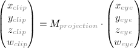

#### Normalized Device coordinates
It is yielded by dividing the clip coordinates by w. It is called perspective division. It is more like window (screen) coordinates, but has not been translated and scaled to screen pixels yet. The range of values is now normalized from -1 to 1 in all 3 axes.

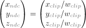

#### Window coordinates
It is obtained by applying normalized device coordinates (NDC) to viewport transformation. The NDC are scaled and translated in order to fit into the rendering screen. The window coordinates finally are passed to the raterization process of OpenGL pipeline. glViewport() command is used to define the rectangle of the rendering area where the final image is mapped. And, glDepthRange() is used to determine the z value of the window coordinates.

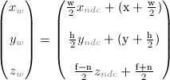

#### OpenGL transformation Matrix
OpenGL uses 4 x 4 matrix for transformations.

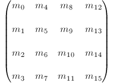
OpenGL has 4 different types of matrices; GL_MODELVIEW, GL_PROJECTION, GL_TEXTURE, and GL_COLOR.

### OpenGL Lighting
OpenGL has 8 kinds of light namely GL LIGHT0 , GL LIGHT1, .... GL LIGHT7
once lighting is enabled, color of this lightings can be selected and position can be assigned. 
For the lighting to work properly, normals to every surface has been defined while drawing.

### Results
1) The following is a swing built using openGL Cylinders. The cylinders are drawn using triangles.
The Swing display motion. This is done by rotating the swing about the hinge point. 
The swing is first moved to origin, rotated by angle theta, theta is then incremented and the scene is rerendered.
**Swing**
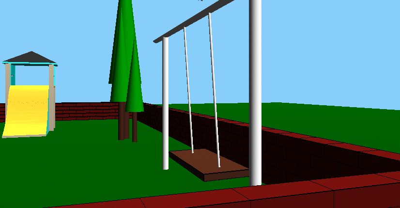

2) Merry Go Round object created using blender also displays motion. This is done by rotating the entire object about the center of the 
merry go round (in the y-axis). As with the swing, the object is first translated to the origin, rotated by angle theta, theta is updated, and the entire
scene is rerendered.
**Merry Go Round**
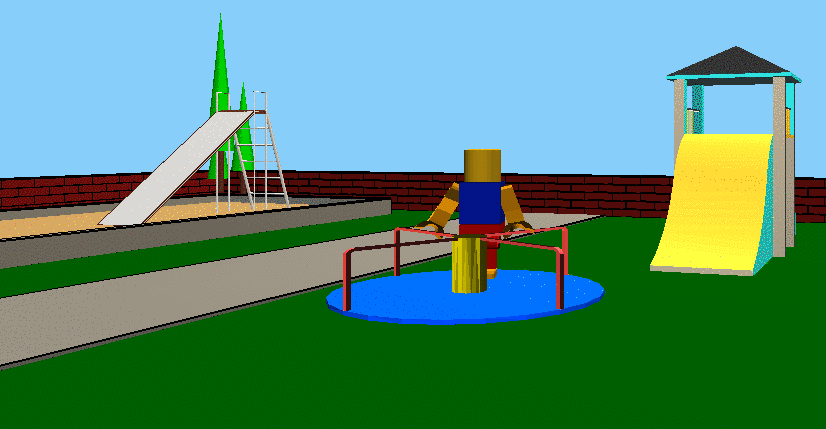

3) **Sand Playground Created Using OpenGL Primitives**
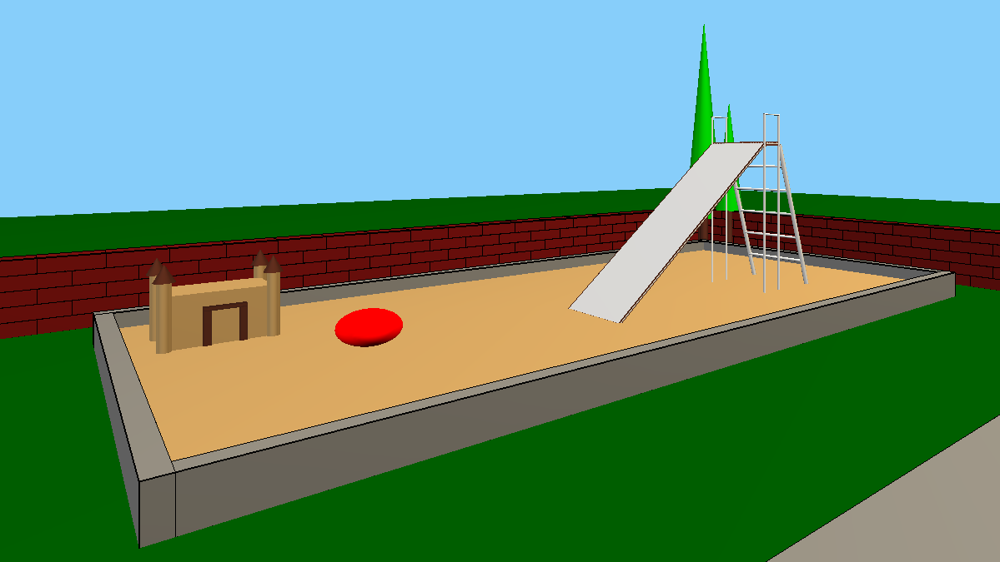

4) **Trees Created Using OpenGL primitives**
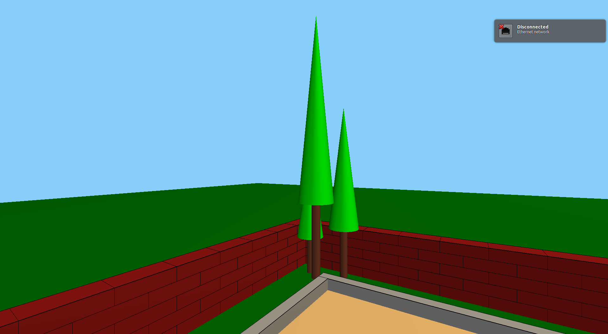

## Task 2: Blender Object Modeling
Blender is an open-source free software developed and maintained by the Blender Foundation. It is used for 3D modeling, rigging and skinning, fluid and smoke simulation etc.
*More on [Blender](https://en.wikipedia.org/wiki/Blender_(software)).*
We used basic features (such as primitives) of blender to model simple objects that can be found in playgrounds.
The following Blender functions were used while modelling the objects-
1. Translation, Rotation and Scaling
2. Editing individual faces and vertices of objects in Edit Mode
3. Extruding
4. Basic modifiers
We modeled the following objects using Blender-
**1. Slide**
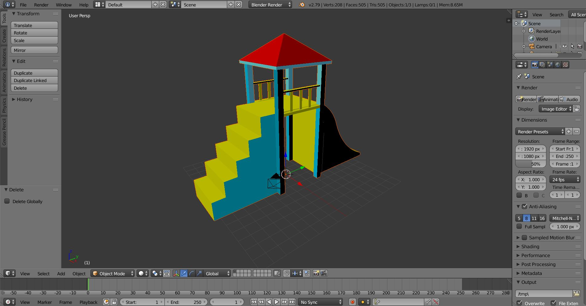
**2. Gate**
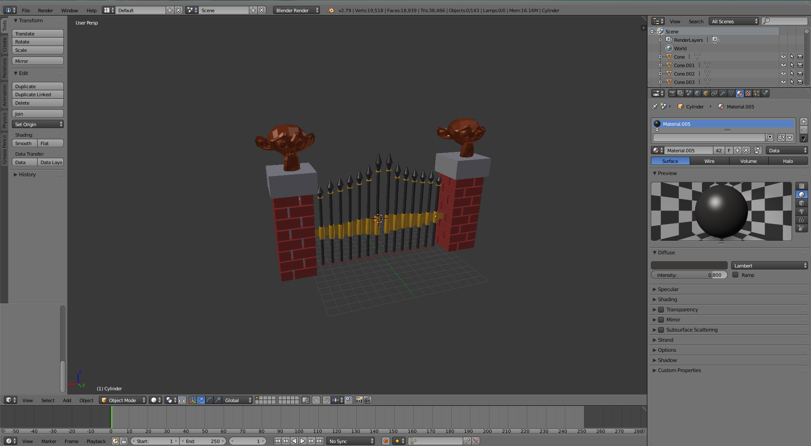
**3. Lego person**
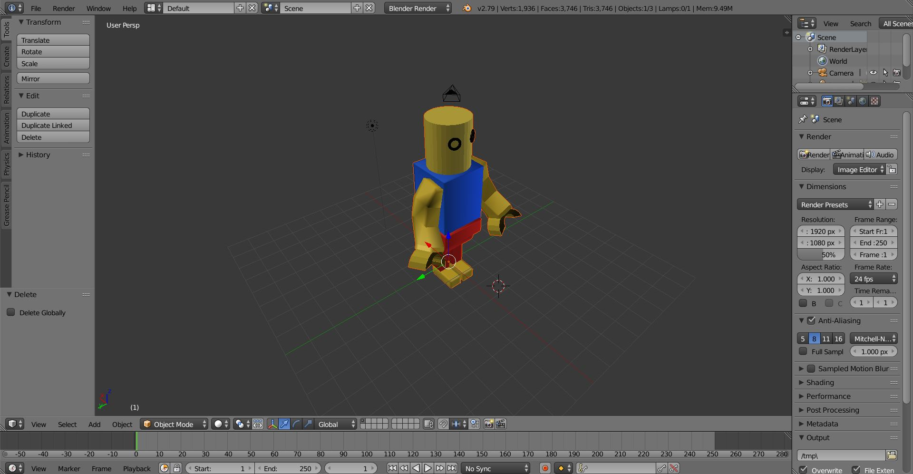
**4. Merry go round**
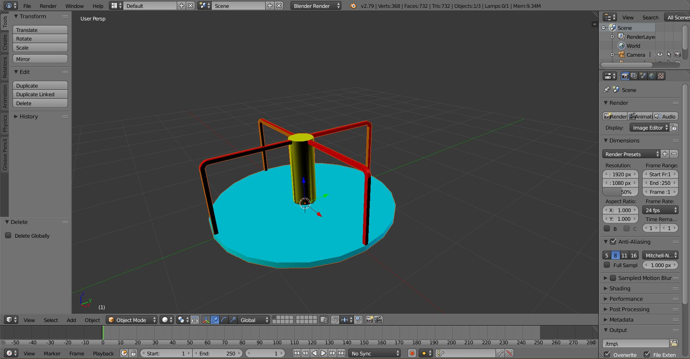

The faces of the object wete triangulated and then expoted in .obj format. These objects were imported in our scene using a custom loader function and OpenGL.

## Results
The following are screenshots of our final scene-
1)
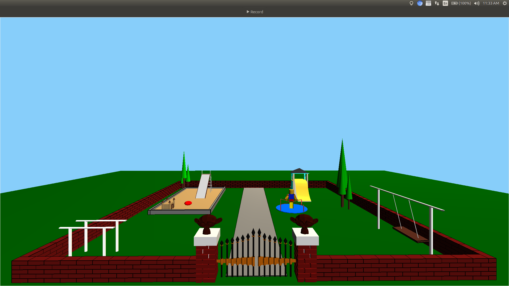

2)
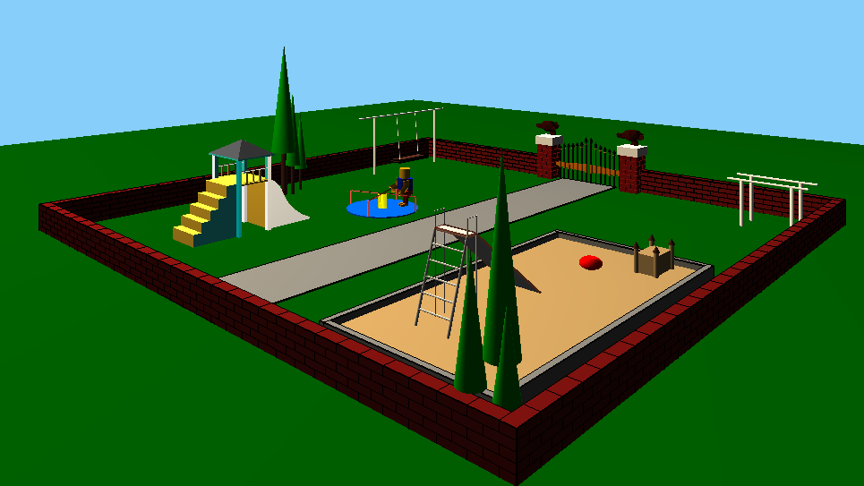
